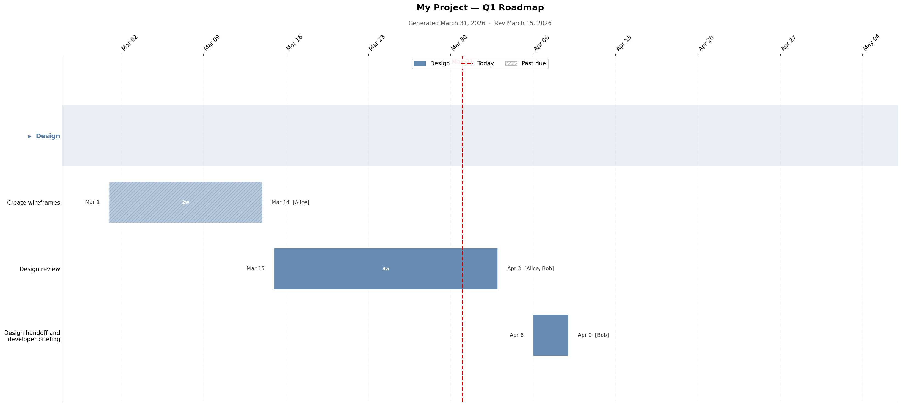

# generate_gantt

A data-driven Gantt chart generator. Define your project tasks in a YAML file and generate a publication-quality PNG or PDF chart with a single command. Regenerate at any time as dates and tasks evolve.



## Features

- **YAML-driven** — all project data lives in one easy-to-edit file
- **Colour-coded groups** — tasks organised into labelled sections, one colour per group
- **Flexible due dates** — specify an explicit `due:` date or a `duration:` (e.g. `2w`, `3d`, `40h`, `1.5m`)
- **Working-day aware** — duration calculations respect a configurable workday schedule (default M–F)
- **Past-due highlighting** — tasks past their due date are automatically dimmed and hatched
- **Today marker** — red dashed vertical line labelled with the current date
- **PNG and/or PDF output** — vector PDF scales perfectly for printing and sharing
- **Auto-named output** — files named `{Project_Name}-{YYYY-MM-DD}_Gantt.{ext}`

## Requirements

```bash
pip install pyyaml matplotlib
```

## Usage

```bash
python3 generate_gantt.py --tasks my_project.yaml            # PNG (default)
python3 generate_gantt.py --tasks my_project.yaml --format pdf
python3 generate_gantt.py --tasks my_project.yaml --format both
python3 generate_gantt.py --tasks my_project.yaml --output custom_name
```

## YAML Format

### `project` section

```yaml
project:
  name: "My Project"           # required — used in chart title and output filename
  subtitle: "Q1 Roadmap"       # optional — appended to title as "Name — Subtitle"
  start: "2026-01-15"          # optional — pins the left edge of the chart
  workdays: "M,T,W,Th,F"      # optional — default M–F; tokens: M T W Th F Sa Su
```

### `groups` section

Tasks are organised into groups, each rendered as a colour-coded section.

```yaml
groups:
  - name: "Design"
    tasks:
      - id: wireframes
        name: "Create wireframes"
        assignee: "Alice"
        start: "2026-02-01"
        due: "2026-02-14"       # explicit end date

      - id: design_review
        name: "Design review"
        assignee: "Alice, Bob"
        start: "2026-02-15"
        duration: "3d"          # or compute end date from duration
```

### Duration formats

When using `duration:` instead of `due:`, the due date is computed by advancing
`start` by the specified number of **working days** (respecting `workdays`).

| Format | Meaning |
|--------|---------|
| `3d`   | 3 working days |
| `2w`   | 2 × working-days-per-week (5 for M–F) |
| `40h`  | 40 hours ÷ 8 hrs/day |
| `1.5m` | 1.5 months × ~21.7 working days/month (M–F week) |

Fractional values are supported (e.g. `2.5d`, `1.7m`). Results round up to the nearest whole working day.

## Example

See [`nexus_tasks.yaml`](nexus_tasks.yaml) for a real-world example with multiple groups, assignees, and a mix of `due` and `duration` fields.
